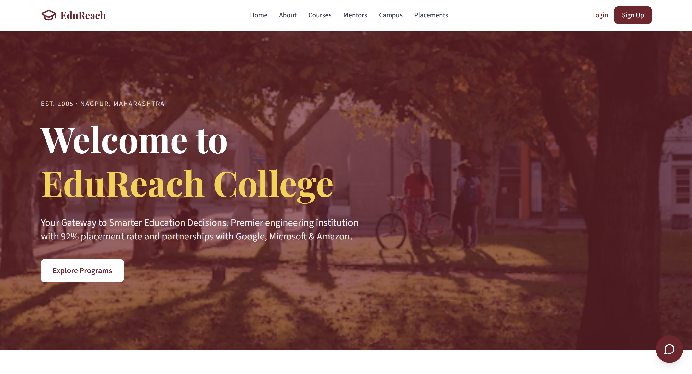
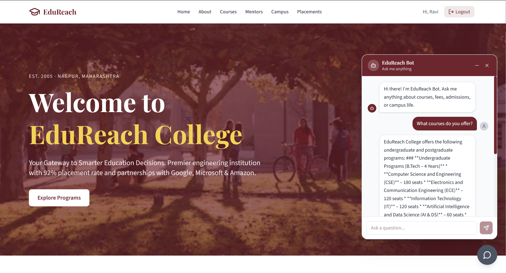
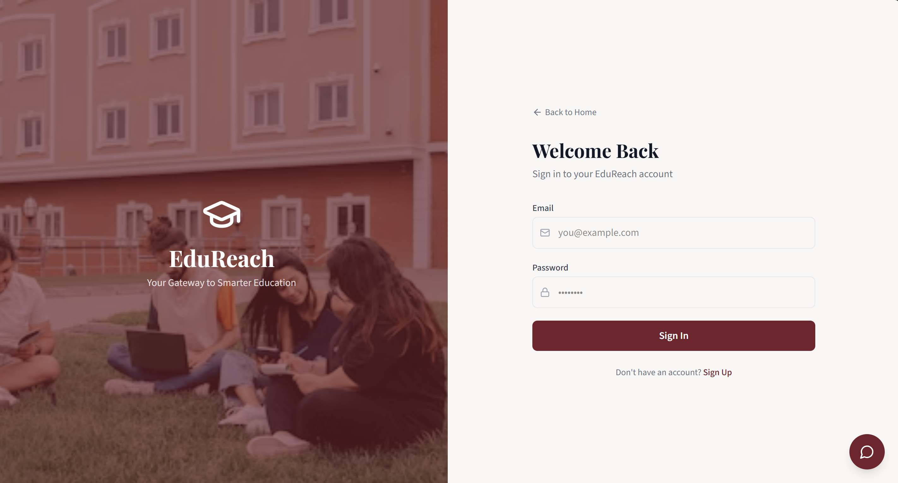
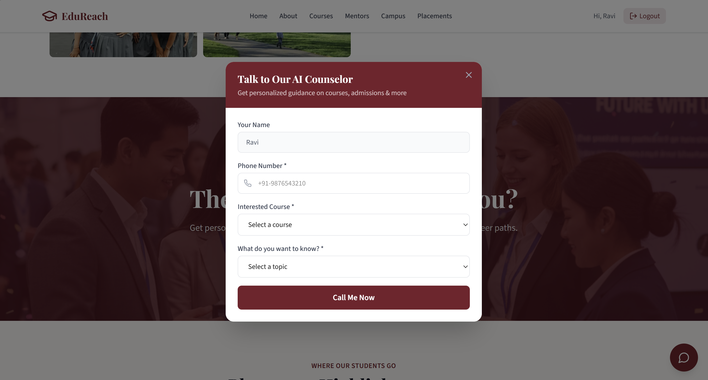

# EduReach — AI-Powered College Assistance Platform

[](./LICENSE)

College websites are static and hard to navigate — students end up calling admissions offices for basic info like fees or placement stats. EduReach solves this with an AI assistant, grounded in the college's real data, available as both a **chat interface** and an **AI voice counselor** that can call students directly.

Built to go beyond a typical CRUD app and get hands-on with real AI engineering: retrieval-augmented generation, vector search, agentic tool use, and voice AI — on top of a complete, deployable full-stack product with proper auth.

**Live Demo:** _add link here_

---

## Table of Contents

- [Features](#features)
- [Tech Stack](#tech-stack)
- [Architecture](#architecture)
- [Project Structure](#project-structure)
- [Getting Started](#getting-started)
- [Environment Variables](#environment-variables)
- [API Reference](#api-reference)
- [How the RAG Chatbot Works](#how-the-rag-chatbot-works)
- [Roadmap](#roadmap)
- [What I Learned](#what-i-learned)
- [Author](#author)

---

## Features

**Authentication**
- JWT-based auth with protected routes
- Password hashing with bcrypt

**AI Chatbot**
- Agentic RAG (the LLM decides when and what to retrieve, rather than a fixed retrieve-then-generate pipeline)
- Semantic search over a college knowledge base using vector embeddings
- Powered by Google Gemini + LangChain

**AI Voice Counselor**
- Outbound calling via Vapi
- Same knowledge base, delivered conversationally over the phone

**Platform**
- Responsive, student-friendly UI
- College information portal (courses, fees, placements, campus life)

---

## Tech Stack

| Layer | Technologies |
|---|---|
| Frontend | React, TypeScript, Tailwind CSS, Axios |
| Backend | Node.js, Express, TypeScript, JWT, bcrypt |
| Database | MongoDB Atlas, Mongoose |
| AI / RAG | Google Gemini, LangChain, Atlas Vector Search |
| Voice AI | Vapi |
| Tooling | Git, GitHub, Postman/Thunder Client |

---

## Architecture

```
                        User
                          │
                          ▼
                 React Frontend (Axios)
                          │
                          ▼
              Node.js + Express Backend
                          │
      ┌───────────────────┼────────────────────┐
      │                   │                    │
      ▼                   ▼                    ▼
JWT Authentication   MongoDB Atlas      LangChain RAG Agent
                    (users, sessions)          │
                                                ▼
                                    Atlas Vector Search
                                     (knowledge base)
                                                │
                                                ▼
                                        Google Gemini
                                                │
                                                ▼
                                     AI-generated response
                                       (text or voice)
```

---

## Project Structure

```
edureach-platform/
├── client/                      React frontend
│   └── src/
│       ├── components/
│       ├── pages/
│       ├── context/
│       └── services/
│
├── server/                      Express backend
│   └── src/
│       ├── controllers/
│       ├── routes/
│       ├── middleware/
│       ├── services/            RAG + Vapi logic
│       ├── models/
│       ├── config/
│       └── knowledge-base/      Source text for the RAG pipeline
│
└── README.md
```

---

## Getting Started

### Prerequisites

- Node.js v20+
- npm
- A MongoDB Atlas account (with a cluster and Atlas Vector Search enabled)
- A Google AI Studio API key (Gemini)
- A Vapi account (for the voice counselor)

### Installation

```bash
git clone https://github.com/ganeshmakade-59/edureach-platform.git
cd edureach-platform
```

**Backend**
```bash
cd server
npm install
npm run dev
```

**Frontend**
```bash
cd client
npm install
npm run dev
```

The backend indexes the knowledge base into MongoDB Atlas on first run (loads → splits → embeds → stores). You'll need an Atlas Vector Search index named `edureach_vector_index` on `edureach_db.knowledge_docs` with `numDimensions: 3072` and `similarity: cosine`, pointed at the `embedding` field.

---

## Environment Variables

Create a `.env` file inside `server/`:

```env
PORT=5000
MONGODB_URI=your_mongodb_connection_string
JWT_SECRET=your_secret_key
JWT_EXPIRES_IN=7d
CLIENT_URL=http://localhost:5173

GOOGLE_API_KEY=your_google_api_key

VAPI_API_KEY=your_vapi_private_key
VAPI_ASSISTANT_ID=your_vapi_assistant_id
VAPI_PHONE_NUMBER_ID=your_vapi_phone_number_id
```

> **Note:** Use Vapi's **private key** here, not the public key — the private key is required for server-side outbound calls.

---

## API Reference

### Authentication

| Method | Endpoint | Auth Required | Description |
|---|---|---|---|
| POST | `/api/auth/register` | No | Create a new user account |
| POST | `/api/auth/login` | No | Authenticate and receive a JWT |
| GET | `/api/auth/me` | Yes | Get the current logged-in user |

### Chat

| Method | Endpoint | Auth Required | Description |
|---|---|---|---|
| POST | `/api/chat/message` | No | Send a message to the RAG chatbot |

### Voice

| Method | Endpoint | Auth Required | Description |
|---|---|---|---|
| POST | `/api/vapi/call` | Yes | Trigger an outbound AI counselor call |

---

## How the RAG Chatbot Works

1. The user sends a question through the chat UI.
2. The request hits the Express backend (`/api/chat/message`).
3. A LangChain **agent** — not a fixed pipeline — decides whether the question needs a knowledge base lookup at all.
4. If it does, the agent calls a `retrieve` tool, which converts the query into a vector and runs a similarity search against MongoDB Atlas Vector Search.
5. The top matching chunks are returned to the agent as context.
6. Google Gemini generates a natural-language answer grounded in that context.
7. The response is sent back to the frontend and rendered in the chat window.

This is called **agentic RAG**: the model can reformulate its search query, decide not to search at all for questions it doesn't need retrieval for, or make multiple searches — rather than blindly retrieving and stuffing context into every response.

---

## Screenshots

| Homepage | AI Chatbot |
|---|---|
|  |  |

| Login | AI Voice Counselor |
|---|---|
|  |  |

---

## Roadmap

- [ ] Admin dashboard for managing the knowledge base
- [ ] PDF upload support for knowledge base content
- [ ] Conversation memory across chat sessions
- [ ] Analytics dashboard for common student queries

---

## What I Learned

Building EduReach was my first deep dive into applied AI engineering on top of a traditional full-stack app:

- Designing and implementing an **agentic RAG pipeline** with LangChain
- Working with **vector embeddings** and Atlas Vector Search end-to-end
- Integrating **Google Gemini** for both embeddings and generation
- Building a **voice AI agent** with Vapi for outbound calls
- Debugging real production issues: DNS/SRV resolution failures, vector index dimension mismatches, database/collection targeting bugs, and API rate limiting
- JWT authentication, protected routes, and clean REST API design in Express + TypeScript

---

## Author

**Ganesh Makade**
B.Tech Electronics Engineering — Minor in Software Engineering

- GitHub: [github.com/ganeshmakade-59](https://github.com/ganeshmakade-59)
- LinkedIn: [linkedin.com/in/ganesh-makade](https://www.linkedin.com/in/ganesh-makade)

If you found this project useful or interesting, consider giving it a ⭐ on GitHub.
